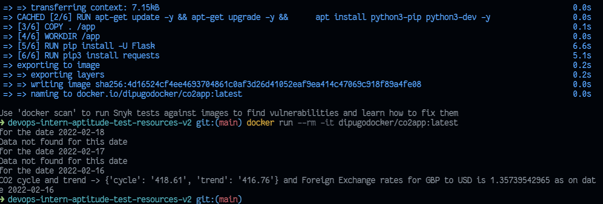

# Steps used to build app

## Task 1
### To build the docker & cluster 

```bash
docker build -t dipugodocker/co2app:latest .
docker run --rm -it dipugodocker/co2app:latest
kubectl apply -f .\kubDeploy.yaml
kubectl get pods
```
then i created the docker CI in github actions
which will run whenever there is a pull, push request


### Output



## Task 2
### python output depending on the that particular date

it will check for the return from the python1
if it fails it will check for todays previous day
if not then yesterday's yesterday and so on

